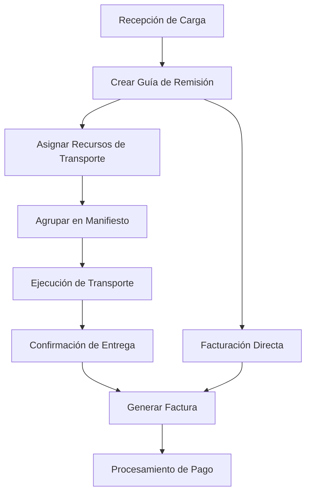

# [Out of support] EVANS - Sistema de Gestión de Transporte


Un sistema integral de gestión de transporte y logística diseñado para empresas de transporte de carga, desarrollado con VB.NET y SQL Server.

## 📋 Tabla de Contenidos

- [Descripción General](#descripción-general)
- [Características](#características)
- [Stack Tecnológico](#stack-tecnológico)
- [Requisitos del Sistema](#requisitos-del-sistema)
- [Instalación](#instalación)
- [Configuración](#configuración)
- [Estructura del Proyecto](#estructura-del-proyecto)
- [Esquema de Base de Datos](#esquema-de-base-de-datos)
- [Uso del Sistema](#uso-del-sistema)
- [Flujo de Procesos de Negocio](#flujo-de-procesos-de-negocio)
- [Contribución](#contribución)
- [Soporte](#soporte)

## 🚀 Descripción General

EVANS es una aplicación empresarial completa diseñada específicamente para empresas de transporte y logística. El sistema gestiona el ciclo completo de transporte de carga desde la recepción hasta la entrega, incluyendo generación de documentos, facturación y capacidades de reportes adaptadas para las regulaciones de transporte peruanas.

### Dominios de Negocio Principales
- **Gestión de Clientes**: Base de datos completa de clientes con múltiples direcciones
- **Gestión de Flota**: Administración de vehículos, carretas y choferes
- **Gestión de Documentos**: Guías de remisión, manifiestos y facturas
- **Operaciones**: Recepción, planificación de transporte y seguimiento de entregas
- **Financiero**: Facturación, emisión de comprobantes y reportes de ventas

## ✨ Características

### 🏢 Gestión de Clientes y Empresas
- **Base de Datos de Clientes**: Operaciones CRUD completas con múltiples direcciones por cliente
- **Tipos de Documento**: Soporte para RUC, DNI y otros tipos de identificación peruanos
- **Soporte Multi-ubicación**: Diferentes direcciones de recojo y entrega
- **Socios Comerciales**: Gestión de empresas subcontratistas y socios

### 🚛 Gestión de Flota y Transporte
- **Registro de Vehículos**: Tractores y carretas con especificaciones completas
- **Gestión de Choferes**: Registros de conductores con seguimiento de licencias
- **Planificación de Rutas**: Gestión de destinos con cálculo de distancia virtual
- **Programación de Transporte**: Asignación eficiente de rutas y recursos

### 📄 Procesamiento de Documentos
- **Guías de Remisión**: Documentos primarios de transporte
- **Manifiestos**: Agrupación de envíos para transporte eficiente
- **Facturación**: Boletas y Facturas con cumplimiento legal
- **Control de Recepción**: Recepción y verificación de carga

### 📊 Reportes y Análisis
- **Integración Crystal Reports**: Impresión profesional de documentos
- **Reportes de Ventas**: Análisis de ingresos y rendimiento
- **Reportes Mensuales de Envíos**: Estadísticas operacionales
- **Consultas Personalizadas**: Recuperación y análisis flexible de datos

### 🖨️ Sistema de Impresión Avanzado
- **Diseñador Visual de Formularios**: Posicionamiento de campos con arrastrar y soltar
- **Gestión de Fuentes**: Selección y formato dinámico de fuentes
- **Vista Previa de Impresión**: Vista previa de documentos WYSIWYG
- **Soporte Multi-formato**: Varios tamaños y diseños de documentos

## 🛠 Stack Tecnológico

| Componente | Tecnología | Versión |
|-----------|------------|---------|
| **Framework** | .NET Framework | 2.0 |
| **Lenguaje** | Visual Basic .NET | 9.0 |
| **IDE** | Visual Studio | 2008 |
| **Base de Datos** | Microsoft SQL Server | 2005+ |
| **Reportes** | Crystal Reports | 10.5 |
| **Controles UI** | Dotnetrix TabControl | 1.0.1.4 |
| **Integración Office** | Microsoft Office Interop Excel | 11.0 |

### Dependencias Externas
- `System.Data.SqlClient` - Conectividad de base de datos
- `CrystalDecisions.*` - Generación de reportes
- `Microsoft.VisualBasic.PowerPacks` - Controles de interfaz mejorados
- `Microsoft.Office.Interop.Excel` - Funcionalidad de exportación a Excel

## 💻 Requisitos del Sistema

### Requisitos Mínimos
- **SO**: Windows XP SP3 o posterior
- **Framework**: .NET Framework 2.0
- **Base de Datos**: SQL Server 2005 Express o superior
- **Memoria**: 512 MB RAM
- **Almacenamiento**: 100 MB de espacio disponible

### Requisitos Recomendados
- **SO**: Windows 7 o posterior
- **Framework**: .NET Framework 4.8 (con compatibilidad)
- **Base de Datos**: SQL Server 2012 o superior
- **Memoria**: 2 GB RAM
- **Almacenamiento**: 1 GB de espacio disponible

### Software Adicional
- Crystal Reports Runtime 10.5
- SQL Server Management Studio (para administración de base de datos)
- Microsoft Office (para funcionalidad de exportación a Excel)

## 🔧 Instalación

### 1. Configuración de Base de Datos
```sql
-- Crear base de datos principal
CREATE DATABASE EVANS;

-- Crear bases de datos anuales para documentos (ejemplo)
CREATE DATABASE [2024];
CREATE DATABASE [2025];
```

### 2. Configuración de la Aplicación
1. Clonar o extraer los archivos del proyecto
2. Abrir `EVANS.sln` en Visual Studio 2008 o IDE compatible
3. Restaurar paquetes NuGet (si aplica)
4. Configurar cadenas de conexión en `app.config`

### 3. Configuración de Conexión a Base de Datos
```xml
<connectionStrings>
    <add name="MainConnection" 
         connectionString="Data Source=SERVIDOR;Initial Catalog=EVANS;Integrated Security=True" />
    <add name="DocumentConnection" 
         connectionString="Data Source=SERVIDOR;Initial Catalog=2024;Integrated Security=True" />
</connectionStrings>
```

### 4. Compilar y Desplegar
```bash
# Compilar la solución
msbuild EVANS.sln /p:Configuration=Release

# Desplegar al directorio objetivo
xcopy /s "bin\Release\*" "C:\Program Files\EVANS\"
```

## ⚙️ Configuración

### Configuración de Base de Datos
El sistema utiliza un enfoque de doble base de datos:
- **Base de Datos Principal (`EVANS`)**: Datos maestros (clientes, vehículos, choferes, etc.)
- **Base de Datos de Documentos (`AAAA`)**: Datos transaccionales (guías, manifiestos, facturas)

### Configuración de Usuario
```vb
' Configuraciones de autenticación por defecto
strServidor = "localhost"
strUsuario = "sa"
strClave = "password"
blAutenticacion = False ' Establecer en True para Autenticación Windows
```

### Configuración de Impresión
El sistema incluye diseños de impresión configurables almacenados en formato XML:
- `Config\guia.xml` - Diseño de guía de remisión
- `Config\factura.xml` - Diseño de factura
- `Config\boleta.xml` - Diseño de boleta

## 📁 Estructura del Proyecto

```
EVANS/
├── EVANS/                          # Carpeta principal de la aplicación
│   ├── bin/                        # Binarios compilados
│   ├── obj/                        # Artefactos de compilación
│   ├── My Project/                 # Archivos de proyecto VB.NET
│   │   ├── Application.Designer.vb
│   │   ├── AssemblyInfo.vb
│   │   ├── Resources.Designer.vb
│   │   └── Settings.Designer.vb
│   ├── Objetos de Negocio/         # Clases de dominio
│   │   ├── clsCliente.vb          # Gestión de clientes
│   │   ├── clsGuiaRemision.vb     # Guía de remisión
│   │   ├── clsComprobante.vb      # Factura/boleta
│   │   ├── clsManifiesto.vb       # Manifiesto
│   │   ├── clsVehiculo.vb         # Vehículo
│   │   ├── clsChofer.vb           # Chofer
│   │   ├── clsDestino.vb          # Destino
│   │   └── ...                    # Otras entidades de negocio
│   ├── Formularios/                # Interfaz de usuario
│   │   ├── frmPrincipal.vb        # Formulario MDI principal
│   │   ├── frmGuiaRemision.vb     # Formulario de guía de remisión
│   │   ├── frmComprobante.vb      # Formulario de factura
│   │   ├── frmManifiesto.vb       # Formulario de manifiesto
│   │   ├── Mantenimiento/         # Formularios de datos maestros
│   │   │   ├── frmMantCliente.vb  # Mantenimiento de clientes
│   │   │   ├── frmMantChofer.vb   # Mantenimiento de choferes
│   │   │   └── ...
│   │   ├── Impresion/             # Formularios de impresión
│   │   │   ├── frmImprimirGuia.vb
│   │   │   ├── frmImprimirFactura.vb
│   │   │   └── frmImprimirBoleta.vb
│   │   └── Reportes/              # Formularios de reportes
│   │       ├── frmReporteVentas.vb
│   │       └── ...
│   ├── Modulos/
│   │   └── modMetodos.vb          # Funciones utilitarias
│   ├── Reportes/
│   │   └── Manifiesto.rpt         # Plantilla Crystal Report
│   ├── Recursos/
│   │   └── Icono.ico              # Icono de la aplicación
│   └── EVANS.vbproj               # Archivo de proyecto
├── Librerías Externas/
│   └── Dotnetrix.TabControl.dll   # Controles de terceros
├── EVANS.sln                      # Archivo de solución
└── README.md                      # Este archivo
```

## 🗃️ Esquema de Base de Datos

### Entidades Principales

#### Tablas de Datos Maestros
- `Cliente` - Información de clientes
- `DireccionCliente` - Direcciones de clientes
- `TipoIdentificacion` - Tipos de ID (RUC, DNI, etc.)
- `Vehiculo` - Registro de vehículos
- `Carreta` - Registro de carretas
- `Chofer` - Información de choferes
- `Destino` - Destinos y rutas
- `Empresa` - Socios comerciales
- `Usuario` - Usuarios del sistema

#### Tablas Transaccionales
- `GuiaRemision` - Guías de remisión
- `DetalleGuia` - Detalles de guías de remisión
- `Comprobante` - Facturas y boletas
- `DetalleComprobante` - Líneas de factura
- `Manifiesto` - Manifiestos de transporte
- `DetalleManifiesto` - Detalles de manifiestos
- `Recepcion` - Registros de recepción de carga

#### Tablas del Sistema
- `Parametros` - Parámetros del sistema
- `Estado` - Códigos de estado
- `TipoComprobante` - Tipos de documento

## 📖 Uso del Sistema

### Iniciando la Aplicación
1. Ejecutar `EVANS.exe`
2. Ingresar credenciales en el formulario de login
3. Se abre la ventana MDI principal con menú de navegación

### Flujo de Trabajo Básico

#### 1. Configuración de Datos Maestros
```
Administración → Clientes → Agregar nuevo cliente
Administración → Choferes → Registrar chofer
Administración → Vehículos → Agregar vehículo/carreta
Administración → Destinos → Configurar rutas
```

#### 2. Procesamiento de Documentos
```
Operaciones → Recepción → Registrar carga entrante
Operaciones → Guía de Remisión → Crear documento de transporte
Operaciones → Manifiesto → Agrupar guías para transporte
Operaciones → Facturación → Generar factura de cliente
```

#### 3. Impresión de Documentos
```
Seleccionar documento → Botón Imprimir → Editor visual (opcional) → Imprimir
```

### Uso de Características Principales

#### Creando una Guía de Remisión
1. Navegar a `Operaciones → Guía de Remisión`
2. Llenar información de remitente y destinatario
3. Agregar detalles de carga en la grilla
4. Asignar vehículo, chofer y ruta
5. Guardar e imprimir el documento

#### Diseñador Visual de Impresión
1. Abrir cualquier documento para impresión
2. Hacer clic en botón "Editar" para entrar al modo diseño
3. Arrastrar y soltar campos a posiciones deseadas
4. Ajustar fuentes y formato
5. Guardar diseño para uso futuro

## 🔄 Flujo de Procesos de Negocio



### Ciclo de Vida de Documentos
1. **Recepción**: La carga llega y se registra
2. **Creación de Guía**: Se genera la guía de remisión
3. **Manifiesto**: Múltiples guías se agrupan para transporte
4. **Transporte**: Movimiento físico de la carga
5. **Facturación**: Documentación de facturación
6. **Reportes**: Análisis y reportes de cumplimiento

## 🤝 Contribución

### Directrices de Desarrollo
1. Seguir convenciones de nomenclatura de VB.NET
2. Mantener integridad de transacciones de base de datos
3. Probar toda la funcionalidad de impresión exhaustivamente
4. Documentar cualquier nueva regla de negocio

### Estilo de Código
```vb
' Usar nombres de variables significativos
Dim objCliente As New clsCliente()

' Manejar excepciones apropiadamente
Try
    ' Código de operación
    Return True
Catch ex As SqlException
    MessageBox.Show(ex.Message, "Error de Base de Datos", MessageBoxButtons.OK, MessageBoxIcon.Error)
    Return False
Catch ex As Exception
    MessageBox.Show(ex.Message, "Error del Sistema", MessageBoxButtons.OK, MessageBoxIcon.Error)
    Return False
Finally
    ' Código de limpieza
End Try
```

### Cambios en Base de Datos
- Siempre usar transacciones para operaciones multi-tabla
- Incluir mecanismos de rollback
- Probar con volúmenes de datos similares a producción
- Documentar cambios de esquema

## 📞 Soporte

### Problemas Comunes

#### Problemas de Calidad de Impresión
```vb
' Configurar impresión de alta calidad
.PrinterSettings.DefaultPageSettings.PrinterResolution.Kind = PrinterResolutionKind.High
.Print(Me, PowerPacks.Printing.PrintForm.PrintOption.FullWindow)
```

#### Problemas de Conexión a Base de Datos
1. Verificar que el servicio SQL Server esté ejecutándose
2. Revisar configuración de cadena de conexión
3. Asegurar que la base de datos existe y el usuario tiene permisos
4. Probar conexión con SQL Server Management Studio

#### Optimización de Rendimiento
- Mantenimiento regular de base de datos (UPDATE STATISTICS)
- Optimización de índices en tablas consultadas frecuentemente
- Archivar documentos antiguos en bases de datos separadas
- Usar pooling de conexiones para operaciones de alto volumen

### Mantenimiento del Sistema
- **Respaldo de Base de Datos**: Implementar programas regulares de respaldo
- **Gestión de Logs**: Monitorear logs de aplicación y SQL Server
- **Gestión de Actualizaciones**: Probar actualizaciones en entorno de pruebas
- **Capacitación de Usuarios**: Proporcionar documentación para nuevas funcionalidades

---

## 📄 Licencia

Este proyecto es software propietario. Todos los derechos reservados.

## 🏢 Acerca de

Sistema de Gestión de Transporte EVANS - Desarrollado para empresas de transporte de carga y logística que requieren gestión operacional integral con enfoque en regulaciones y requisitos de documentación de transporte peruanos.

---

*Para soporte técnico o solicitudes de nuevas funcionalidades, por favor contactar al equipo de desarrollo.*