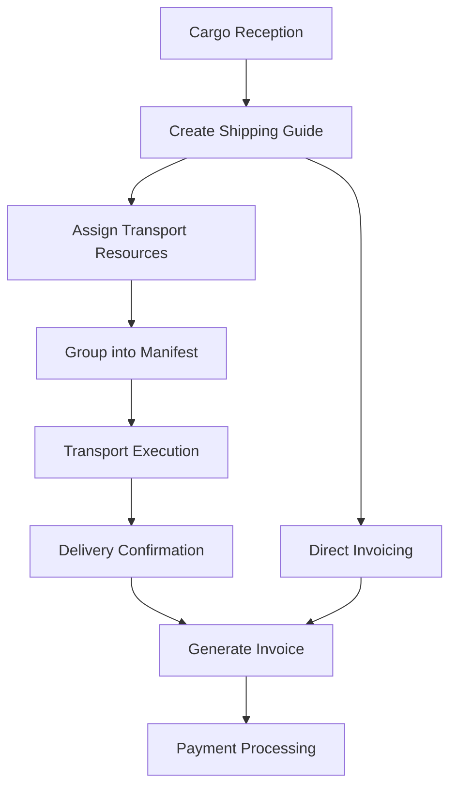

# EVANS - Transportation Management System


A comprehensive transportation and logistics management system designed for cargo transport companies, built with VB.NET and SQL Server.

## 📋 Table of Contents

- [Overview](#overview)
- [Features](#features)
- [Technology Stack](#technology-stack)
- [System Requirements](#system-requirements)
- [Installation](#installation)
- [Configuration](#configuration)
- [Project Structure](#project-structure)
- [Database Schema](#database-schema)
- [Usage](#usage)
- [Business Process Flow](#business-process-flow)
- [Contributing](#contributing)
- [Support](#support)

## 🚀 Overview

EVANS is a full-featured enterprise application designed specifically for transportation and logistics companies. The system manages the complete cargo transport lifecycle from reception to delivery, including document generation, invoicing, and reporting capabilities tailored for Peruvian transportation regulations.

### Key Business Domains
- **Client Management**: Complete customer database with multiple addresses
- **Fleet Management**: Vehicles, trailers, and driver administration
- **Document Management**: Shipping guides, manifests, and invoices
- **Operations**: Reception, transport planning, and delivery tracking
- **Financial**: Billing, invoicing, and sales reports

## ✨ Features

### 🏢 Client & Business Management
- **Customer Database**: Complete CRUD operations with multiple addresses per client
- **Document Types**: Support for RUC, DNI, and other Peruvian identification types
- **Multi-location Support**: Different pickup and delivery addresses
- **Business Partners**: Subcontractor and partner company management

### 🚛 Fleet & Transport Management
- **Vehicle Registry**: Tractors and trailers with complete specifications
- **Driver Management**: Driver records with license tracking
- **Route Planning**: Destination management with virtual distance calculation
- **Transport Scheduling**: Efficient route and resource allocation

### 📄 Document Processing
- **Shipping Guides (Guías de Remisión)**: Primary transport documents
- **Manifests**: Grouped shipments for efficient transport
- **Invoicing**: Boletas and Facturas with legal compliance
- **Reception Control**: Cargo reception and verification

### 📊 Reporting & Analytics
- **Crystal Reports Integration**: Professional document printing
- **Sales Reports**: Revenue and performance analytics
- **Monthly Shipping Reports**: Operational statistics
- **Custom Queries**: Flexible data retrieval and analysis

### 🖨️ Advanced Printing System
- **Visual Form Designer**: Drag-and-drop positioning for document fields
- **Font Management**: Dynamic font selection and formatting
- **Print Preview**: WYSIWYG document preview
- **Multi-format Support**: Various document sizes and layouts

## 🛠 Technology Stack

| Component | Technology | Version |
|-----------|------------|---------|
| **Framework** | .NET Framework | 2.0 |
| **Language** | Visual Basic .NET | 9.0 |
| **IDE** | Visual Studio | 2008 |
| **Database** | Microsoft SQL Server | 2005+ |
| **Reports** | Crystal Reports | 10.5 |
| **UI Controls** | Dotnetrix TabControl | 1.0.1.4 |
| **Office Integration** | Microsoft Office Interop Excel | 11.0 |

### External Dependencies
- `System.Data.SqlClient` - Database connectivity
- `CrystalDecisions.*` - Report generation
- `Microsoft.VisualBasic.PowerPacks` - Enhanced UI controls
- `Microsoft.Office.Interop.Excel` - Excel export functionality

## 💻 System Requirements

### Minimum Requirements
- **OS**: Windows XP SP3 or later
- **Framework**: .NET Framework 2.0
- **Database**: SQL Server 2005 Express or higher
- **Memory**: 512 MB RAM
- **Storage**: 100 MB available space

### Recommended Requirements
- **OS**: Windows 7 or later
- **Framework**: .NET Framework 4.8 (with compatibility)
- **Database**: SQL Server 2012 or higher
- **Memory**: 2 GB RAM
- **Storage**: 1 GB available space

### Additional Software
- Crystal Reports Runtime 10.5
- SQL Server Management Studio (for database administration)
- Microsoft Office (for Excel export functionality)

## 🔧 Installation

### 1. Database Setup
```sql
-- Create main database
CREATE DATABASE EVANS;

-- Create yearly databases for documents (example)
CREATE DATABASE [2024];
CREATE DATABASE [2025];
```

### 2. Application Configuration
1. Clone or extract the project files
2. Open `EVANS.sln` in Visual Studio 2008 or compatible IDE
3. Restore NuGet packages (if applicable)
4. Configure connection strings in `app.config`

### 3. Database Connection Configuration
```xml
<connectionStrings>
    <add name="MainConnection" 
         connectionString="Data Source=SERVER;Initial Catalog=EVANS;Integrated Security=True" />
    <add name="DocumentConnection" 
         connectionString="Data Source=SERVER;Initial Catalog=2024;Integrated Security=True" />
</connectionStrings>
```

### 4. Build and Deploy
```bash
# Build the solution
msbuild EVANS.sln /p:Configuration=Release

# Deploy to target directory
xcopy /s "bin\Release\*" "C:\Program Files\EVANS\"
```

## ⚙️ Configuration

### Database Configuration
The system uses a dual-database approach:
- **Main Database (`EVANS`)**: Master data (clients, vehicles, drivers, etc.)
- **Document Database (`YYYY`)**: Transactional data (guides, manifests, invoices)

### User Configuration
```vb
' Default authentication settings
strServidor = "localhost"
strUsuario = "sa"
strClave = "password"
blAutenticacion = False ' Set to True for Windows Authentication
```

### Printing Configuration
The system includes configurable printing layouts stored in XML format:
- `Config\guia.xml` - Shipping guide layout
- `Config\factura.xml` - Invoice layout
- `Config\boleta.xml` - Receipt layout

## 📁 Project Structure

```
EVANS/
├── EVANS/                          # Main application folder
│   ├── bin/                        # Compiled binaries
│   ├── obj/                        # Build artifacts
│   ├── My Project/                 # VB.NET project files
│   │   ├── Application.Designer.vb
│   │   ├── AssemblyInfo.vb
│   │   ├── Resources.Designer.vb
│   │   └── Settings.Designer.vb
│   ├── Business Objects/           # Domain classes
│   │   ├── clsCliente.vb          # Customer management
│   │   ├── clsGuiaRemision.vb     # Shipping guide
│   │   ├── clsComprobante.vb      # Invoice/receipt
│   │   ├── clsManifiesto.vb       # Manifest
│   │   ├── clsVehiculo.vb         # Vehicle
│   │   ├── clsChofer.vb           # Driver
│   │   ├── clsDestino.vb          # Destination
│   │   └── ...                    # Other business entities
│   ├── Forms/                      # User interface
│   │   ├── frmPrincipal.vb        # Main MDI form
│   │   ├── frmGuiaRemision.vb     # Shipping guide form
│   │   ├── frmComprobante.vb      # Invoice form
│   │   ├── frmManifiesto.vb       # Manifest form
│   │   ├── Maintenance/           # Master data forms
│   │   │   ├── frmMantCliente.vb  # Customer maintenance
│   │   │   ├── frmMantChofer.vb   # Driver maintenance
│   │   │   └── ...
│   │   ├── Printing/              # Printing forms
│   │   │   ├── frmImprimirGuia.vb
│   │   │   ├── frmImprimirFactura.vb
│   │   │   └── frmImprimirBoleta.vb
│   │   └── Reports/               # Report forms
│   │       ├── frmReporteVentas.vb
│   │       └── ...
│   ├── Modules/
│   │   └── modMetodos.vb          # Utility functions
│   ├── Reports/
│   │   └── Manifiesto.rpt         # Crystal Report template
│   ├── Resources/
│   │   └── Icono.ico              # Application icon
│   └── EVANS.vbproj               # Project file
├── External Libraries/
│   └── Dotnetrix.TabControl.dll   # Third-party controls
├── EVANS.sln                      # Solution file
└── README.md                      # This file
```

## 🗃️ Database Schema

### Core Entities

#### Master Data Tables
- `Cliente` - Customer information
- `DireccionCliente` - Customer addresses
- `TipoIdentificacion` - ID types (RUC, DNI, etc.)
- `Vehiculo` - Vehicle registry
- `Carreta` - Trailer registry
- `Chofer` - Driver information
- `Destino` - Destinations and routes
- `Empresa` - Business partners
- `Usuario` - System users

#### Transactional Tables
- `GuiaRemision` - Shipping guides
- `DetalleGuia` - Shipping guide details
- `Comprobante` - Invoices and receipts
- `DetalleComprobante` - Invoice line items
- `Manifiesto` - Transport manifests
- `DetalleManifiesto` - Manifest details
- `Recepcion` - Cargo reception records

#### System Tables
- `Parametros` - System parameters
- `Estado` - Status codes
- `TipoComprobante` - Document types

## 📖 Usage

### Starting the Application
1. Launch `EVANS.exe`
2. Enter credentials in the login form
3. Main MDI window opens with navigation menu

### Basic Workflow

#### 1. Master Data Setup
```
Administration → Clients → Add new customer
Administration → Drivers → Register driver
Administration → Vehicles → Add vehicle/trailer
Administration → Destinations → Configure routes
```

#### 2. Document Processing
```
Operations → Reception → Register incoming cargo
Operations → Shipping Guide → Create transport document
Operations → Manifest → Group guides for transport
Operations → Invoicing → Generate customer invoice
```

#### 3. Printing Documents
```
Select document → Print button → Visual editor (optional) → Print
```

### Key Features Usage

#### Creating a Shipping Guide
1. Navigate to `Operations → Shipping Guide`
2. Fill sender and recipient information
3. Add cargo details in the grid
4. Assign vehicle, driver, and route
5. Save and print the document

#### Visual Print Designer
1. Open any document for printing
2. Click "Edit" button to enter design mode
3. Drag and drop fields to desired positions
4. Adjust fonts and formatting
5. Save layout for future use

## 🔄 Business Process Flow



### Document Lifecycle
1. **Reception**: Cargo arrives and is registered
2. **Guide Creation**: Shipping guide is generated
3. **Manifest**: Multiple guides grouped for transport
4. **Transport**: Physical movement of cargo
5. **Invoicing**: Billing documentation
6. **Reporting**: Analytics and compliance reports

## 🤝 Contributing

### Development Guidelines
1. Follow VB.NET naming conventions
2. Maintain database transaction integrity
3. Test all printing functionality thoroughly
4. Document any new business rules

### Code Style
```vb
' Use meaningful variable names
Dim objCliente As New clsCliente()

' Handle exceptions appropriately
Try
    ' Operation code
    Return True
Catch ex As SqlException
    MessageBox.Show(ex.Message, "Database Error", MessageBoxButtons.OK, MessageBoxIcon.Error)
    Return False
Catch ex As Exception
    MessageBox.Show(ex.Message, "System Error", MessageBoxButtons.OK, MessageBoxIcon.Error)
    Return False
Finally
    ' Cleanup code
End Try
```

### Database Changes
- Always use transactions for multi-table operations
- Include rollback mechanisms
- Test with production-like data volumes
- Document schema changes

## 📞 Support

### Common Issues

#### Printing Quality Problems
```vb
' Configure high-quality printing
.PrinterSettings.DefaultPageSettings.PrinterResolution.Kind = PrinterResolutionKind.High
.Print(Me, PowerPacks.Printing.PrintForm.PrintOption.FullWindow)
```

#### Database Connection Issues
1. Verify SQL Server service is running
2. Check connection string configuration
3. Ensure database exists and user has permissions
4. Test connection with SQL Server Management Studio

#### Performance Optimization
- Regular database maintenance (UPDATE STATISTICS)
- Index optimization on frequently queried tables
- Archive old documents to separate databases
- Use connection pooling for high-volume operations

### System Maintenance
- **Database Backup**: Implement regular backup schedules
- **Log Management**: Monitor application and SQL Server logs
- **Update Management**: Test updates in staging environment
- **User Training**: Provide documentation for new features

---

## 📄 License

This project is proprietary software. All rights reserved.

## 🏢 About

EVANS Transportation Management System - Developed for cargo transport and logistics companies requiring comprehensive operational management with focus on Peruvian transportation regulations and documentation requirements.

---

*For technical support or feature requests, please contact the development team.*